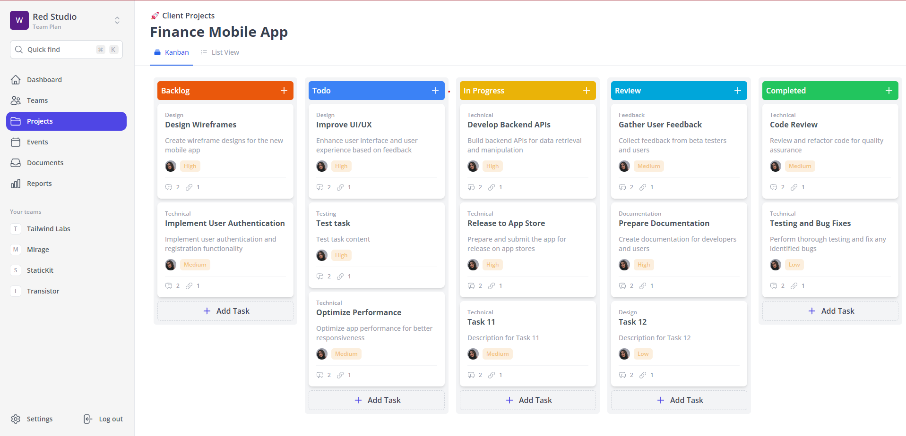
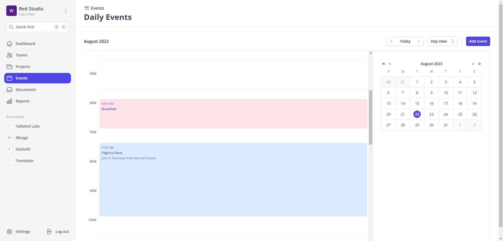

#Rocket Rails (Task and Team Management Platform) (In progress)

##Technologies used

* Nuxt JS 3 (Vue 3)
* Tailwind CSS
* Serverless Functions
* MongoDB (Mongoose ORM)

##Project Page

-Kanban/List View to manage and assign tasks to team members with respect to priority and categories

##Event Page

")

-View/Create/Delete events from your timeline
-Google/Outlook map integration
-Month/Day View (Year/Week view coming soon!)

##Other Pages coming soon